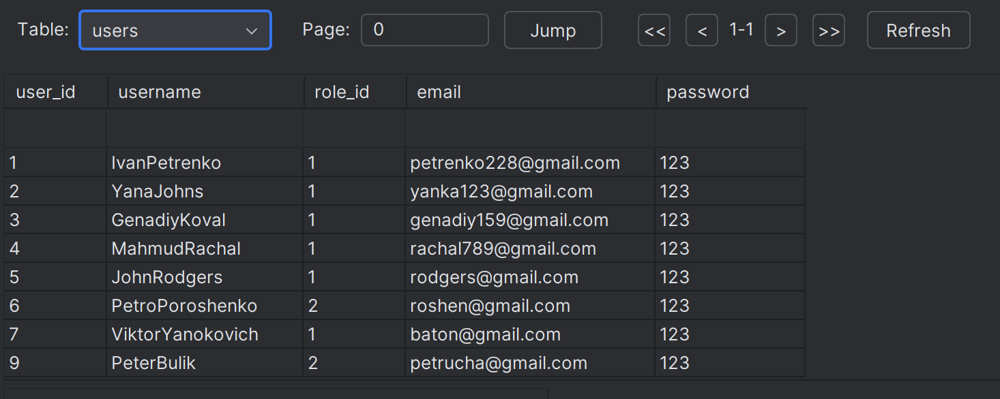
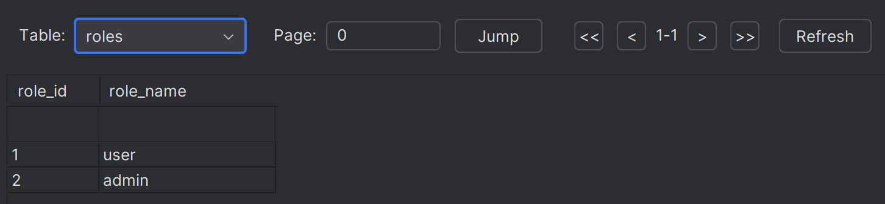
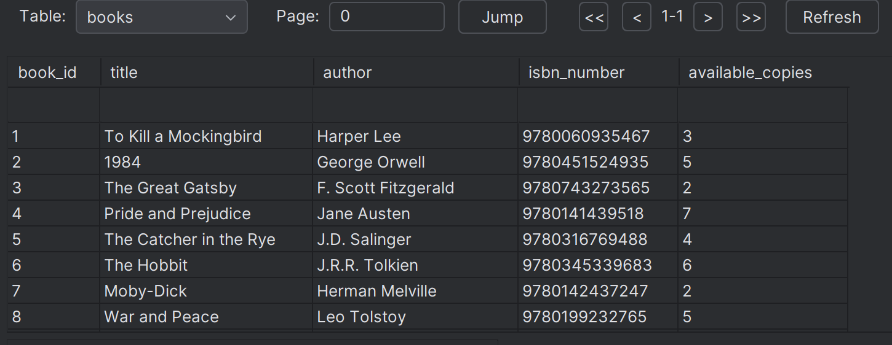
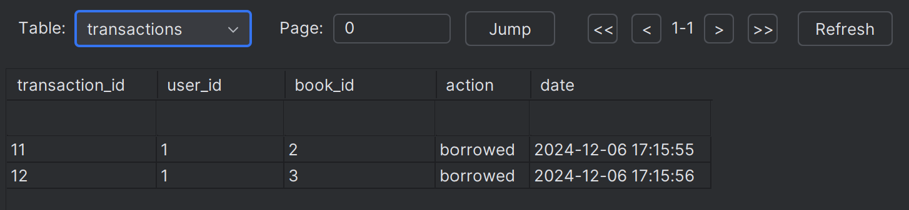
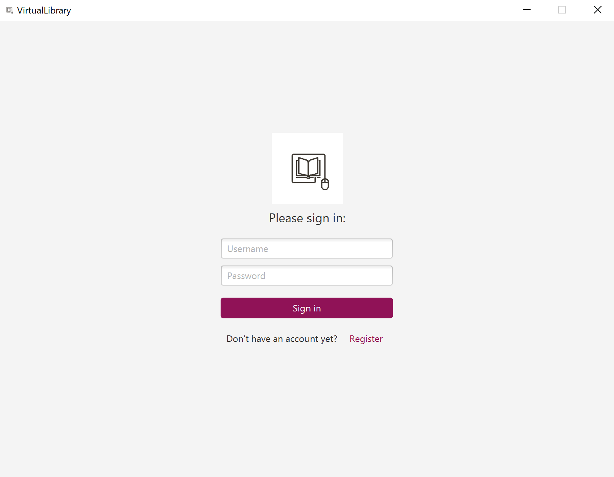
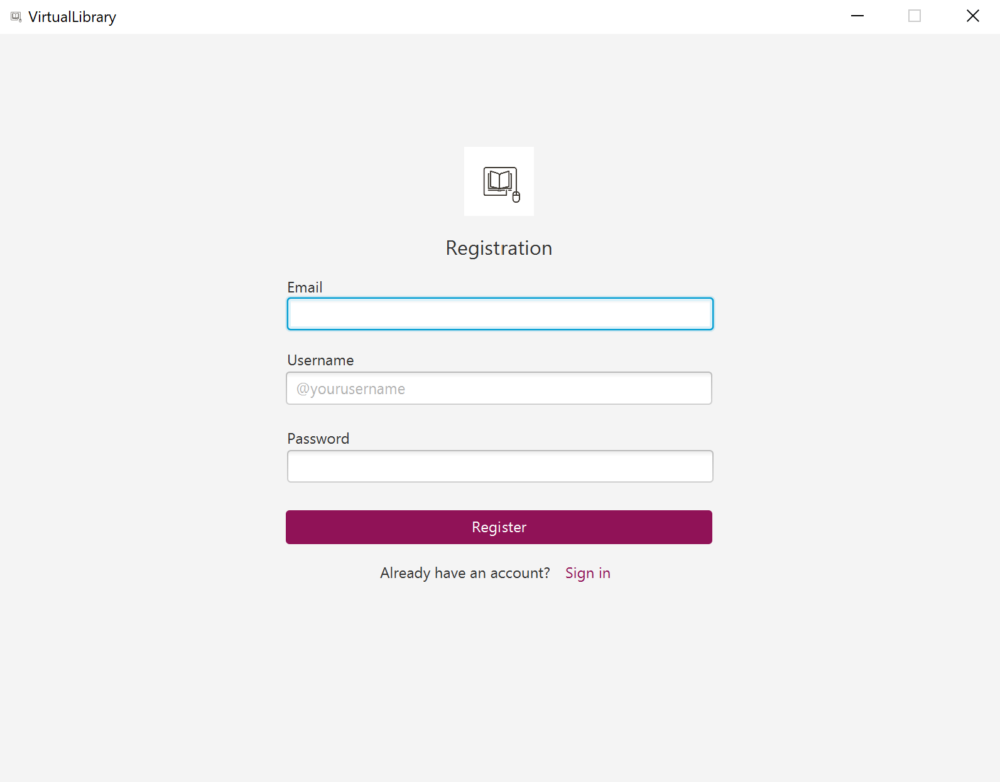
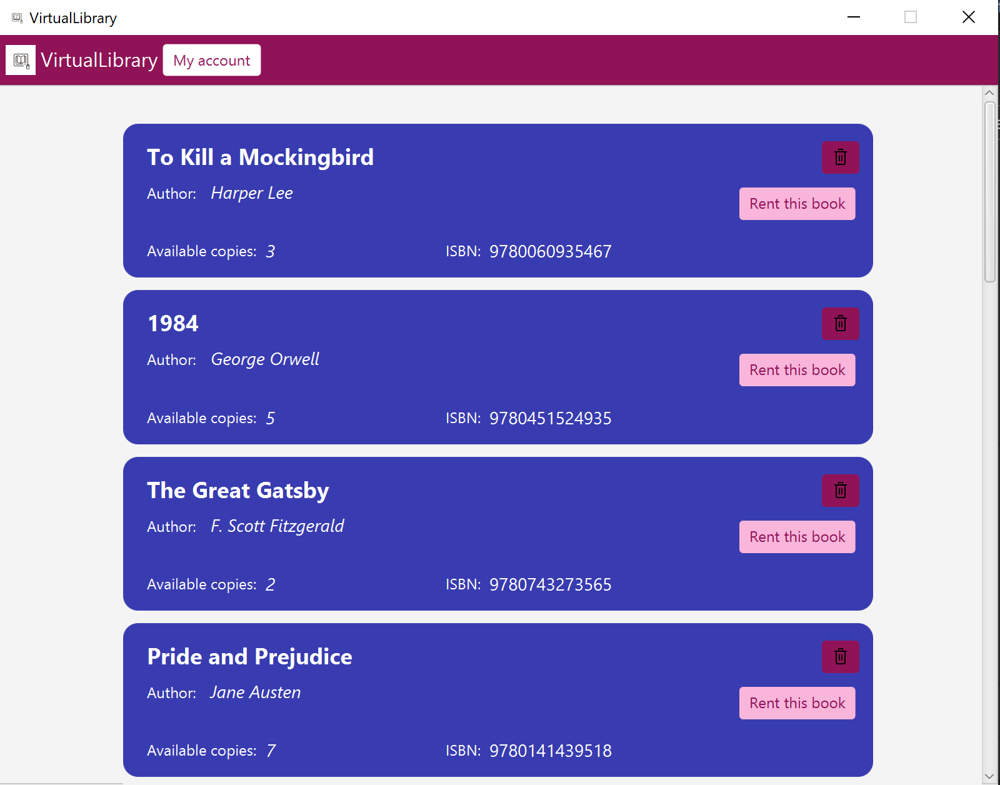
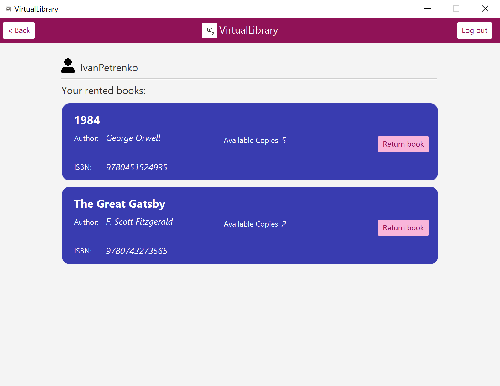
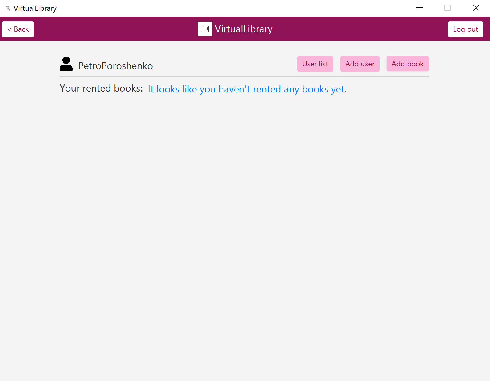

# Library Management System

## Project Overview
This project implements a Library Management System, designed to manage books, users, and transactions.
It provides functionalities for adding, borrowing, and listing books as well as managing user roles and authentication.
The system consists of a **JavaFX-based user interface** and a **Spring Boot backend** connected via RESTful APIs.

---

## Technology Stack
- **Frontend**: JavaFX for building the user interface.
- **Backend**: Spring Boot for handling business logic and exposing RESTful APIs.
- **Database**: SQLite for persistent data storage.
- **Communication**: RESTful APIs for client-server interactions.

---

## Classes and Functions
### JavaFX Controllers
The controllers manage user interactions with the application interface.
- `AccountController.java`: Handles account settings and user information display.
- `AddBookController.java`: Manages adding new books to the library.
- `AddUserController.java`: Handles adding new users to the system.
- `BookCardController.java`: Controls the UI representation of a single book.
- `LogInController.java`: Manages user login functionality.
- `RegistrationController.java`: Handles new user registration.
- `RentedBookCardController.java`: Manages UI for rented books.
- `SampleController.java`: Contains additional sample controls for prototyping.
- `UserCardController.java`: Controls the display of user information.
- `UserListController.java`: Manages the UI for listing all users.

### JavaFX Models
These models encapsulate the data structure for the application:
- `Book.java`: Represents a book entity with attributes like title, author, and availability.
- `User.java`: Represents a user entity with attributes like name, email, and role.
- `Transaction.java`: Encapsulates borrowing and returning book transactions.
- `Session.java`: Manages user sessions.
- `ViewChanger.java`: Provides utilities for switching views in the application.

### Spring Boot Controllers
These controllers expose REST endpoints for handling API requests:
- `BookController.java`: Handles book-related operations (add, list, delete, borrow, return).
- `UserController.java`: Manages user-related operations (registration, details, roles).
- `LogInController.java`: Provides login and session management functionality.
- `TransactionController.java`: Handles book borrowing and returning transactions.

### Spring Boot Services
These services implement the business logic:
- `BookService.java`: Implements CRUD operations for books.
- `UserService.java`: Manages user authentication and registration.
- `TransactionService.java`: Handles borrowing and returning books.
- `DatabaseService.java`: Utility service for database interactions.

---

## RESTful API
### Endpoints
Here are some key API endpoints implemented in the Spring Boot backend:
- **Books**:
   - `GET /books`: Fetch all books.
   - `POST /books`: Add a new book.
   - `PUT /books/{id}`: Update book details.
- **Users**:
   - `DELETE /users`: Delete a user.
   - `GET /users`: Fetch all users.
   - `POST /users`: Create a new user.
   - `GET /users/{id}`: Get user details by ID.
   - `GET /users/username/{username}`: Get user details by username.
   - `POST /users/update`: Update user details.
- **Transactions**:
   - `POST /transactions/bookTake`: Borrow a book.
   - `POST /transactions/returnBook`: Return a book.
   - `GET /transactions/user/{id}`: Get all transactions by a specific user.

---

## Database Design
The database uses a relational schema with the following tables:
1. **Users**: Stores user information (ID, name, role, email, password).
   
2. **Roles**: Stores role information (role_id, role_name).
   
3. **Books**: Stores book details (ID, title, author, ISBN, status).
   
4. **Transactions**: Tracks borrowing of books.
   

---

## User Interface
The JavaFX application provides a seamless user experience with:
- Login and Registration screens.
   
- Library page where you can rent a book (or delete it, if it's administrator account).
  
- User account where you can see your rented books and return them.
  
- Administrator account where you can control books and users.
  

---

## Challenges and Approach
### Challenges
1. Implementing secure communication between the frontend and backend.
2. Preventing SQL injection in API endpoints.
3. Handling concurrent transactions on the same book.

### Solutions
- Used HTTPS for securing RESTful API communication.
- Parameterized queries in SQLite to prevent SQL injection.
- Implemented transaction locking to manage concurrency.

---

## How to Run
1. Clone the repository and navigate to the project directory.
2. Start the backend server:

3. Start the JavaFX application:

  

---

## Contributors
 - Daryna Vynnyk

 - Kateryna Vynnyk

